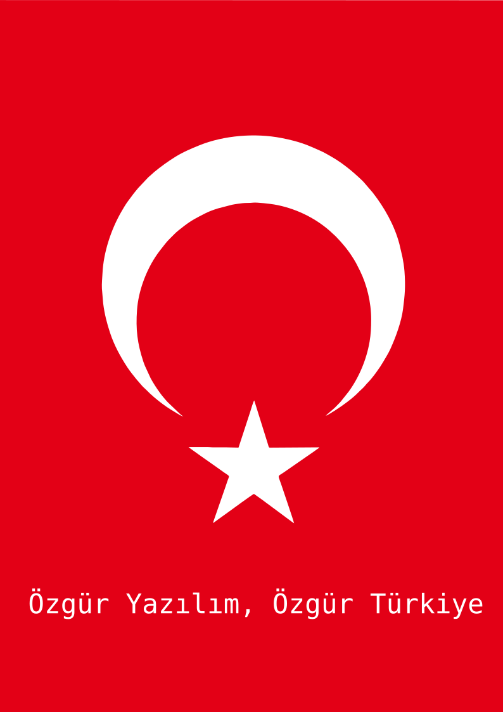
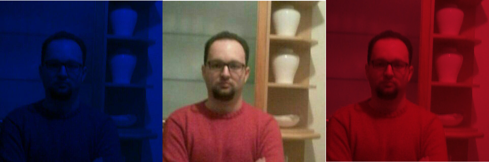

<h1 align=center>Hi People ! I'm Mert Gör from Türkiye, İstanbul 🇹🇷 ☭ </h1>
 
<h3 align="center">We proudly initialized the core and head center organization called <a href="https://www.github.com/qbnetworks" target="_blank">QB Networks</a> for strategical decision making for The Masscollabs Services and its subprojects my e-mail is  <a href="mailto:mertgor@qbnetworks.xyz">mertgor@qbnetworks.xyz</a> and my GPG Key ID is 0xD200B456637BC4F3  As <a href="https://www.github.com/masscollabs" target="_blank">Masscollabs Services</a> founder my e-mail is  <a href="mailto:mertgor@masscollabs.xyz">mertgor@masscollabs.xyz</a> and my GPG Key ID is 0x03E547D043AB6C8F  As <a href="https://www.github.com/procyberian" target="_blank">PSD(Procyberian Systems Distribution)</a> Core Team Leader my e-mail is <a href="mailto:mertgor@procyberian.xyz">mertgor@procyberian.xyz</a> and my GPG Key ID is 0xD5A31B8B1A6F02BC  😎 I'm a systems programmer who loves internet and cloud computing...  I am a happy hacker ☭  I want to lead to The Free Software Movement 🇹🇷☭  My motto is "leaders more leaders" I am about to become a world citizen who loves many human languages! 🇹🇷☭ I am hwpplayer1 on irc.libera.chat also you may jump into #fsf channel for messaging me
</h3>

About me README file

Copyright (C) 2013-2024 Mert Gör and contributors

This program is free software: you can redistribute it and/or modify
it under the terms of the GNU Affero General Public License as published
by the Free Software Foundation, either version 3 of the License, or
(at your option) any later version.

This program is distributed in the hope that it will be useful,
but WITHOUT ANY WARRANTY; without even the implied warranty of
MERCHANTABILITY or FITNESS FOR A PARTICULAR PURPOSE.  See the
GNU Affero General Public License for more details.

You should have received a copy of the GNU Affero General Public License
along with this program.  If not, see <https://www.gnu.org/licenses/>.

Feel free to send an email for your questions to mertgor at masscollabs dot xyz

