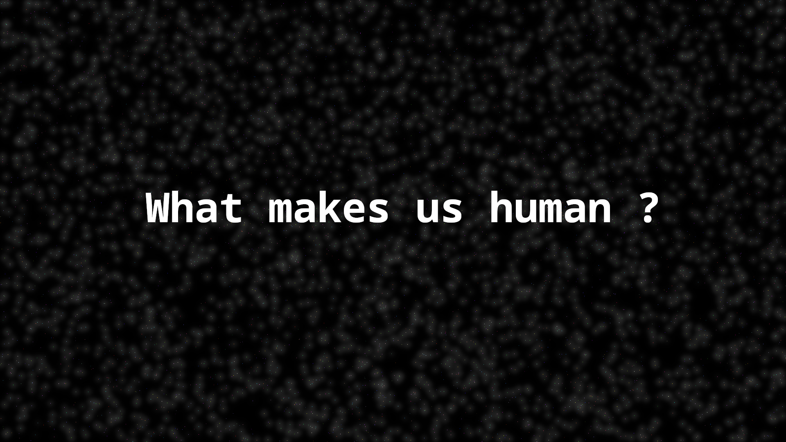

# İstanbul'dan Selamlar ve Sevgiler !... 🇹🇷 



I'm a systems programmer and Free Software leader candidate from İstanbul, Türkiye 🇹🇷, who is deeply immersed in the world of internet and cloud computing. I’m passionate about the Free Software Movement, and my guiding motto is **"leaders more leaders."** I'm committed to building and inspiring open infrastructures that empower everyone to take control of their digital destiny.

---

## 🇹🇷 About Me

- **Systems Programmer & Free Software Leadership:** I work full-time to lead global initiatives in Free Software and cyber security. I believe that true protection comes from having access to source code—if you don’t have it, you can’t truly secure it.
  
- **Philosophy:** My work is driven by the idea that our *social existence determines our consciousness*. This philosophy underpins my commitment to creating freedom-respecting solutions that champion openness over secrecy.
  
- **Cultural Explorer:** As I strive to become a world citizen, I embrace many human languages and diverse cultures, which enrich my open and collaborative approach.

---


---

## 🇹🇷 Projects & Initiatives

- **PSD (Procyberian Systems Distribution):** I lead to **[PSD](https://github.com/procyberian)** driving this project to develop the next generation of Free Software. PSD is about ensuring that digital systems are free as in freedom, open, secure, and accessible for all humanity.
- **QB Networks:** Our team provides 24/7/365 cyber security solutions for the public, always prioritizing freedom-respecting practices.
- **Masscollabs Services:** A cloud platform dedicated to supporting and cultivating Free Software communities and projects.

---

## 🇹🇷 ```ping```

- **IRC:** You can find me as `hwpplayer1` on [irc.libera.chat](https://libera.chat/) — join the `#fsf` channel for a chat about free software and cyber security.
- **Email:** 
  - QB Networks: <mertgor@qbnetworks.xyz>  
  - Masscollabs Services: <mertgor@masscollabs.xyz>  
  - PSD (Procyberian Systems Distribution): <mertgor@procyberian.xyz>
- **GPG Key IDs:**  
  - QB Networks: `0xD200B456637BC4F3`  
  - Masscollabs Services: `0x03E547D043AB6C8F`  
  - PSD: `0xD5A31B8B1A6F02BC`
- **Social Media**
  - [Twitter/X](https://x.com/MertGor)
  - [Linkedin](https://www.linkedin.com/in/hwpplayer1/)
  - [infosec.exchange](https://infosec.exchange/@hwpplayer1)

- **Free Software Foundation's Free Software Directory**
  - [Free Software Directory](https://directory.fsf.org/wiki/User:Mertgor)
- **Personal Website**
  - [Website](https://mertgor.xyz)

---

## 🇹🇷 Conclusion

This profile and my projects are released under the [GNU Affero General Public License version 3 or later](https://www.gnu.org/licenses/agpl-3.0.html). All my code is built on the principle that freedom starts with transparency—when you have access to the source, you have power over security.

I firmly believe that open communication and collaboration are the cornerstones of innovation. With every line of code, I strive to contribute to a digital future where knowledge is shared, security is inherent, and every person has the right to understand the tools they use.

Happy hacking, and let's keep building a Free Society with Free Software together!

---

## License

About me README file

Copyright (C) 2013-2025 Mert Gör and contributors

This program is free software: you can redistribute it and/or modify
it under the terms of the GNU Affero General Public License as published
by the Free Software Foundation, either version 3 of the License, or
(at your option) any later version.

This program is distributed in the hope that it will be useful,
but WITHOUT ANY WARRANTY; without even the implied warranty of
MERCHANTABILITY or FITNESS FOR A PARTICULAR PURPOSE.  See the
GNU Affero General Public License for more details.

You should have received a copy of the GNU Affero General Public License
along with this program.  If not, see <https://www.gnu.org/licenses/>.

## Artwork License

[CC BY-SA 4.0 or later](by-sa.markdown)


